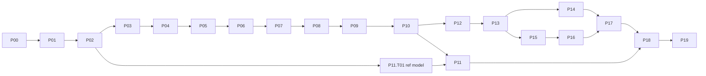

# BLDC Motor Simulator — Implementation Plan & Workflow

> **Start here.** This is the master plan for agents (and humans) building the simulator.
> Inputs: [POLISHED_IDEA.md](POLISHED_IDEA.md) (what to build) · [TOOLS_TO_USE.md](TOOLS_TO_USE.md) (what to build it with).
> Planned 2026-10-08.

## 0. Plan files

| File | What it holds | When to read |
|---|---|---|
| **PLAN.md** (this file) | Workflow rules, progress dashboard, phase overview, policies | Every session, first |
| [plan/CONVENTIONS.md](plan/CONVENTIONS.md) | Repo layout, naming, the shared ID namespace, units, physics conventions, code style | Every session (at least once per context) |
| [plan/phase-NN-*.md](plan/) | Tasks of one phase, with steps, verification and fixes | The phase you are working on |
| [plan/TROUBLESHOOTING.md](plan/TROUBLESHOOTING.md) | What to do when things don't install, compile, run or pass | When stuck |
| [plan/DECISIONS.md](plan/DECISIONS.md) | Decision log (ADR-style), including ones made during implementation | Before changing anything architectural; append new decisions |
| [plan/LOG.md](plan/LOG.md) | Append-only work journal (one entry per session/task batch) | Read the last ~3 entries at session start; append at the end |
| [plan/progress.py](plan/progress.py) | Progress tracker: rewrites the dashboard below, lists next tasks, checks plan format | After every status change |

---

## 1. Progress dashboard

<!-- PROGRESS:START -->
_Auto-generated by `just progress` (or `python3 Context/plan/progress.py`). Do not edit by hand._

**Overall: 24 / 217 tasks (11%)** `███░░░░░░░░░░░░░░░░░░░░░░░░░░░`

| Phase | Title | Done | Progress | State |
|---|---|---|---|---|
| [P00](plan/phase-00-environment.md) | Environment & bootstrap | 14/14 | `██████████` | ✅ done |
| [P01](plan/phase-01-walking-skeleton.md) | Walking skeleton | 10/12 | `████████░░` | 🟧 in progress |
| [P02](plan/phase-02-physics-spec.md) | Physics specification (docs-first) | 0/14 | `░░░░░░░░░░` | ⬜ todo |
| [P03](plan/phase-03-engine-core.md) | Simulation engine core | 0/16 | `░░░░░░░░░░` | ⬜ todo |
| [P04](plan/phase-04-parameter-model.md) | Parameter model, units, schemas & presets | 0/14 | `░░░░░░░░░░` | ⬜ todo |
| [P05](plan/phase-05-motor-model.md) | Motor electromagnetic model | 0/11 | `░░░░░░░░░░` | ⬜ todo |
| [P06](plan/phase-06-mechanics-thermal.md) | Mechanics & thermal | 0/9 | `░░░░░░░░░░` | ⬜ todo |
| [P07](plan/phase-07-power-electronics.md) | Power electronics & power supply | 0/12 | `░░░░░░░░░░` | ⬜ todo |
| [P08](plan/phase-08-sensors.md) | Sensors & estimators | 0/9 | `░░░░░░░░░░` | ⬜ todo |
| [P09](plan/phase-09-control.md) | Control system | 0/14 | `░░░░░░░░░░` | ⬜ todo |
| [P10](plan/phase-10-faults-energy.md) | Faults, protection, energy balance & warnings | 0/8 | `░░░░░░░░░░` | ⬜ todo |
| [P11](plan/phase-11-validation.md) | Independent validation suite | 0/10 | `░░░░░░░░░░` | ⬜ todo |
| [P12](plan/phase-12-api-mcp.md) | Full API, streaming & MCP | 0/9 | `░░░░░░░░░░` | ⬜ todo |
| [P13](plan/phase-13-ui-foundation.md) | UI foundation | 0/12 | `░░░░░░░░░░` | ⬜ todo |
| [P14](plan/phase-14-visualization.md) | Motor visualization (PixiJS) | 0/9 | `░░░░░░░░░░` | ⬜ todo |
| [P15](plan/phase-15-plots-recording.md) | Live plots & recording | 0/7 | `░░░░░░░░░░` | ⬜ todo |
| [P16](plan/phase-16-control-editor.md) | Control-loop editor | 0/7 | `░░░░░░░░░░` | ⬜ todo |
| [P17](plan/phase-17-library-editors.md) | Library, model editors, wizard, scenarios & faults UI | 0/9 | `░░░░░░░░░░` | ⬜ todo |
| [P18](plan/phase-18-docs-lessons.md) | Documentation content & guided lessons | 0/12 | `░░░░░░░░░░` | ⬜ todo |
| [P19](plan/phase-19-hardening.md) | Hardening & release v1.0 | 0/9 | `░░░░░░░░░░` | ⬜ todo |

**In progress:** none

**Blocked:** none

**Next available:** `P01.T11` Playwright smoke E2E
<!-- PROGRESS:END -->

---

## 2. Agent session protocol (follow in order)

1. **Orient**
   - Read this file (§1–§9), [CONVENTIONS.md](plan/CONVENTIONS.md), and the last 3 entries of [LOG.md](plan/LOG.md).
   - Run `python3 Context/plan/progress.py --next` (after Phase 0: `just next`) to see startable tasks.
   - If `graphify-out/graph.json` exists, ask graphify about the area you are about to touch, e.g. `graphify query "how does the scheduler fire controller blocks"` (see §6).
2. **Pick a task**
   - **First, background subagent tasks:** if a startable `🤖 SUBAGENT` task exists (e.g. P11.T01 once P02 is done), start its subagent **in the background** and mark it `[~]` (it doesn't count against your one-task limit). When it reports back, verify its output and close the task.
   - Otherwise pick the **lowest-numbered startable task**: status `[ ]` and every dependency `[x]`/`[-]`. The user may also name a task.
   - Change its box to `[~]` and run `python3 Context/plan/progress.py`.
   - Work on **one task at a time**. Only one task may be `[~]` per agent, plus background subagent tasks.
3. **Read before coding**
   - Read the whole task block, the phase header ("Read first"), and any spec it cites (e.g. `EQ-MOT-03` in `docs/docs/physics/`).
4. **Implement**
   - Keep changes scoped to the task.
   - If you find missing work, **add a new task** to the right phase file (next free ID, with `Depends`) instead of silently expanding scope.
5. **Verify**
   - Run every command in the task's **Verify** line, then the fast gate `just check-fast` (from Phase 0 on).
   - A task is not done until its verification passes. "It compiles" is not verification.
6. **If stuck**
   - Follow the task's **If stuck** hints, then [TROUBLESHOOTING.md](plan/TROUBLESHOOTING.md).
   - After **3 genuinely different failed approaches**, set the task to `[!]`, write the blocker (error output, what you tried) under the task and in LOG.md, and ask the user.
7. **Close the task** (in this order, so everything lands in one commit)
   1. Set the box to `[x]` and run `just progress`.
   2. Append a LOG.md entry.
   3. Commit: `git add -A && git commit -m "P03.T05: <summary>"` (see §7).
8. **Phase end**
   - The last task of every phase is the **Phase gate** (§8). Do not start the next phase's tasks until the gate is `[x]`.
   - Exception: tasks whose `Depends` lists only earlier, finished work may start early (the dashboard's "Next available" accounts for this).

**Status markers** (inside the checkbox):

| Marker | Meaning | Rule |
|---|---|---|
| `[ ]` | todo | |
| `[~]` | in progress | Max one per agent. If you find a stale `[~]` with no LOG entry, treat it as abandoned: inspect `git status` and finish or reset it. |
| `[x]` | done | Verification passed and committed. |
| `[!]` | blocked | Add an indented `- **Blocked:** <reason, date>` line. |
| `[-]` | skipped/deferred | Add an indented `- **Skipped:** <reason, who decided>`. Only the user may approve skipping. |

---

**Shell note for agents:** the agent's Bash tool runs **bash**, while the user's login shell is **fish**. Tools installed by mise are reached via the shims directory, which P00.T02 puts on PATH for bash. If a tool is "not found", first run `export PATH="$HOME/.local/share/mise/shims:$HOME/.local/bin:$PATH"` or prefix the command with `mise x --`.

**👤 manual checks:** some verifications need a human (GPU fps on real hardware, visual look). Ask the user to confirm them and record the answer in LOG. Never claim them as verified yourself.

## 3. Task format (for anyone adding tasks)

```markdown
- [ ] **P03.T02** — Short imperative title
  - **Depends:** P03.T01, P02          ← task IDs and/or whole phases; "none" if none
  - **Do:** what to build, concretely (numbered sub-steps if > 2 steps)
  - **Files:** paths created/changed
  - **Verify:** exact commands + expected result
  - **Done when:** observable acceptance criteria
  - **If stuck:** task-specific hints (optional)
```

- IDs are never reused or renumbered. New tasks get the next free number in that phase, even if they logically sit earlier. Put the logical order in `Depends`.
- `👤 USER` in a title means the task needs the human (sudo, accounts, decisions). Ask, don't guess.
- `🤖 SUBAGENT` marks a task where a pre-approved subagent is used (§5).
- Run `python3 Context/plan/progress.py --check` after editing plan files. The lefthook pre-commit hook runs it too.

---

## 4. Golden rules

1. **Physics correctness beats features.**
   - Every equation in code cites its spec ID (`// EQ-MOT-03`), and the spec lives in `docs/docs/physics/`.
   - If code and spec disagree, stop: fix the spec first (with a reference), then the code.
2. **Never loosen a test tolerance or delete a failing test to get green.** If a tolerance really must change, record a decision in DECISIONS.md with the numerical justification.
3. **One namespace for everything.** A parameter or signal has one path (e.g. `motor.electrical.kv`), used in YAML, the API, MCP, the help registry and UI `data-agent-id` (see CONVENTIONS §3). Adding a parameter means adding all of: schema field, help entry, docs anchor, and UI exposure (the UI is schema-driven, so mostly automatic).
4. **Deterministic simulation.** Same scene + scenario + seed → identical output. All randomness goes through the seeded RNG service.
5. **No panics in the sim loop.** Return errors. Detect NaN/Inf and auto-pause with a diagnostic event.
6. **Small, verified steps.** Commit after every task. Do not leave the repo in a non-building state between tasks.
7. **Ask the user** before: installing anything with `sudo`, creating accounts/remote repos, spawning a non-pre-approved subagent (§5), changing scope/architecture decisions recorded in DECISIONS.md, or skipping a task.
8. **Readable code.** The user reads Python and C/C++, not Rust/TS. Write plain Rust (no clever generics or macro magic), comment the *why*, and keep physics functions short and named after the equation.
9. **Keep docs and help in sync.** CI (`just check`) fails on a missing help entry or a broken docs anchor.

---

## 5. Subagent policy

| Use | Status | How |
|---|---|---|
| **Independent reference model** (P11.T01) | ✅ Pre-approved | `general-purpose` agent, run in the background. It may read **only** `docs/docs/physics/**` (incl. the signal catalog `signals.md`), CONVENTIONS §5/§6-Python and `validation/pyproject.toml`. It is told never to read `crates/`, `web/` or `presets/`. The exact prompt is in the task. |
| **Phase-end review** (every phase gate) | ✅ Pre-approved | A fresh `general-purpose` agent with no prior context. It reviews the phase's diff (`git diff <phase-start-commit>..HEAD`) against the phase's exit criteria and the spec, and reports findings. The prompt template is in §8. |
| graphify extraction agents | ✅ Approved (user: "you can call it") | Spawned internally by the graphify skill for doc extraction. Code-only updates need none. |
| Anything else (parallel feature work, Explore searches, docs writers…) | ❓ Ask the user first | Explain what and why in one line, and wait for approval. |

Subagent results are **reports, not truth**. The main agent verifies each finding before acting on it.

---

## 6. graphify (knowledge graph) usage

- **Setup:** P00.T11 installs graphify (`uv tool install graphifyy`), builds the first graph with the `/graphify .` skill, and installs the post-commit hook (`graphify hook install`), which auto-updates the graph for **code** changes after every commit.
- **Docs/plan changes** are not picked up by the hook. Run `/graphify . --update` at each phase gate (the step is in the gate checklist).
- **Before touching unfamiliar code**, query instead of reading many files: `graphify query "<question>"`, `graphify path "Scheduler" "FocController"`, `graphify explain "SignalBus"`.
- `graphify-out/` is git-ignored (regenerable, local).

---

## 7. Git workflow

- Work **directly on `main`**, with one commit per task (or a few, for large tasks).
- Message format: `P05.T03: cogging torque model (EQ-MOT-07)`. Phase gates: `P05: phase gate`.
- End every commit message with the attribution trailer configured for the agent (e.g. `Co-Authored-By: ...`).
- lefthook pre-commit runs fast format/lint and the plan check. If a hook fails, fix the issue; never use `--no-verify`.
- Never rewrite published history (no `push --force`, no amending commits from previous sessions).
- Tag each finished phase: `git tag phase-05-done`. The phase-end review uses `phase-04-done..HEAD` as its diff range.
- Pushing: only if a remote exists (P00.T13). CI runs on push.

---

## 8. Phase gate (last task of every phase)

Every phase file ends with a gate task. Its checklist:

1. All other tasks in the phase are `[x]` or `[-]` (user-approved skips only).
2. `just check` passes (full: fmt, lint, all tests, validation suite as far as it exists, docs build, plan check).
3. Exit criteria in the phase header are demonstrably met. Paste the evidence (command output summaries) into the LOG entry.
4. **Phase-end review subagent** (pre-approved). Spawn a `general-purpose` agent with this prompt, filling in `<NN>`, `<PREV>`, `<EXIT CRITERIA>`:
   > You are reviewing Phase <NN> of a BLDC motor simulator (Rust core/server, React UI, Python validation) in `/mnt/D/projects/autism/BLDC_Motor_Simulation`. You have no prior context.
   > Read `Context/PLAN.md` §4, `Context/plan/CONVENTIONS.md`, `Context/plan/phase-<NN>-*.md`, then the diff `git diff phase-<PREV>-done..HEAD`.
   > Check:
   > (1) each exit criterion: <EXIT CRITERIA>;
   > (2) physics/maths correctness against `docs/docs/physics/` (cite EQ IDs);
   > (3) bugs, unhandled errors, panics in the sim loop, nondeterminism;
   > (4) tests that are weak, missing or tautological;
   > (5) violations of the conventions (ID namespace, units, help entries).
   > Run the verification commands yourself where useful. **Do not edit files.**
   > Report a list of findings, each with file:line, severity (blocker/major/minor), and a concrete fix. Report "no findings" if none.
   - Diff-range note: if some of this phase's tasks were committed before `phase-<PREV>-done` (e.g. P11.T01, which runs early), also give the reviewer the list from `git log --oneline --grep "^P<NN>\."`.
5. The main agent verifies the findings and fixes blockers/majors, or adds them as new tasks in the next phase with the user's OK. Minors may be logged as tasks.
6. Run `/graphify . --update`.
7. Mark the gate `[x]`, run `just progress`, commit `PNN: phase gate`, `git tag phase-NN-done`, and write a LOG entry summarizing the phase.

---

## 9. Phase overview

Strategy: **walking skeleton first** (P01 gives a thin end-to-end slice through every layer), then deepen the layers. The physics **spec is written before the physics code** (P02), so the independent reference model (P11.T01) can be built from the spec in parallel.

| # | Phase | Goal | Depends |
|---|---|---|---|
| 00 | [Environment & bootstrap](plan/phase-00-environment.md) | Toolchains, repo skeleton, task runner, hooks, CI file, graphify | — |
| 01 | [Walking skeleton](plan/phase-01-walking-skeleton.md) | Ideal motor + FOC → CLI, server, WS, MCP, UI plot + spinning rotor, docs site, 1 validation test | 00 |
| 02 | [Physics specification](plan/phase-02-physics-spec.md) | Every equation, convention and test case written as docs with IDs + references | 01 |
| 03 | [Simulation engine core](plan/phase-03-engine-core.md) | Time base, signal bus, integrators, multi-rate scheduler, runner, snapshots, recorder | 02 |
| 04 | [Parameter model & presets](plan/phase-04-parameter-model.md) | Units, schemas, provenance, constraint graph, YAML library, generic presets, wizard logic | 03 |
| 05 | [Motor electromagnetics](plan/phase-05-motor-model.md) | abc model, back-EMF shapes, cogging, iron loss, saturation | 04 |
| 06 | [Mechanics & thermal](plan/phase-06-mechanics-thermal.md) | Gearbox + backlash, friction, arm/gravity loads, thermal network | 05 |
| 07 | [Power electronics & supply](plan/phase-07-power-electronics.md) | Switching/averaged inverter, PWM/SVPWM, losses, PSU, battery, bus, regen, chopper | 06 |
| 08 | [Sensors](plan/phase-08-sensors.md) | Halls, magnetic/optical encoders, ADCs, observer | 07 |
| 09 | [Control](plan/phase-09-control.md) | Six-step, open-loop, FOC cascade, MIT, sensorless, Luau block, auto-tune | 08 |
| 10 | [Faults, protection, energy](plan/phase-10-faults-energy.md) | Fault injection, protections, energy-balance accounting, warnings | 09 |
| 11 | [Validation suite](plan/phase-11-validation.md) | Independent Python reference model, analytic/cross/property/regression tests, report | 02 (T01), 10 (rest) |
| 12 | [API & MCP](plan/phase-12-api-mcp.md) | Full REST/WS API, OpenAPI, UI-command channel, MCP tools, integration tests | 10 |
| 13 | [UI foundation](plan/phase-13-ui-foundation.md) | Theme, layout, API client, agent IDs, help tooltips, unit inputs, param panels, status bar | 12 |
| 14 | [Motor visualization](plan/phase-14-visualization.md) | PixiJS geometry, coils, particles, load arm, direct manipulation | 13 |
| 15 | [Plots & recording](plan/phase-15-plots-recording.md) | uPlot panels, cursors, recording/export | 13 |
| 16 | [Control-loop editor](plan/phase-16-control-editor.md) | React Flow diagram, block config, Luau editor, auto-tune UI | 15 |
| 17 | [Library, editors & scenarios](plan/phase-17-library-editors.md) | Library browser, motor editor, datasheet wizard, scenes, scenario timeline, faults UI | 14, 16 |
| 18 | [Docs content & lessons](plan/phase-18-docs-lessons.md) | Full docs, generated references, live widgets, lessons, llms.txt | 17, 11 |
| 19 | [Hardening & release](plan/phase-19-hardening.md) | Performance, E2E + agent journeys, resilience, packaging, v1.0 | 18 |



---

## 10. Global Definition of Done (every task)

- [ ] Code builds with no new warnings (`cargo clippy -- -D warnings`, `biome check`, `ruff check`).
- [ ] Tests for the new behavior exist and pass. Physics code has at least one test with an independent expected value (analytic, reference or conservation law).
- [ ] New/changed parameters and signals have help-registry entries and docs anchors (from P13 on; before that, a `TODO(help)` list in LOG.md).
- [ ] Public API changes are reflected in OpenAPI/MCP (from P12 on).
- [ ] Task box `[x]`, dashboard regenerated, commit made, LOG entry appended.

---

## 11. Key commands (available after P00/P01)

| Command | Does |
|---|---|
| `just setup` | Install all toolchains and deps (mise, cargo fetch, pnpm install, uv sync, playwright chromium) |
| `just dev` | Run server (`:8787`) + web dev server (`:5173`, proxies `/api`, `/mcp`) |
| `just docs-dev` | Docs dev server (`:3000`) |
| `just test` | All tests (Rust, web, Python validation) |
| `just validate` | Python validation suite + report |
| `just check-fast` | fmt check + clippy + all Rust/web unit tests + plan check — no validate/e2e/docs build (use per task) |
| `just check` | Everything incl. E2E, docs build, plan check (use at phase gates) |
| `just build` | Release single binary with embedded UI + presets → `target/release/bldc-sim` |
| `just progress` / `just next` | Regenerate dashboard / list startable tasks |
| `bldc-sim serve` · `bldc-sim run-scenario <file>` · `bldc-sim dump-openapi` · `bldc-sim dump-schemas` | Binary subcommands |
