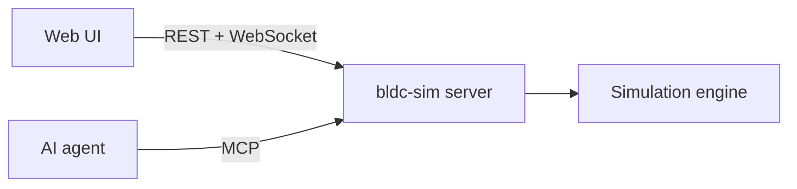

# BLDC Motor Simulator — documentation

A local simulator and learning lab for brushless permanent-magnet motors (BLDC/PMSM), focused on high-torque, low-RPM motors.

These docs are under construction. They will cover the user interface, motor fundamentals, the exact physics and maths used, power electronics, sensors, control theory, guided lessons, and the API/MCP reference for AI agents.

