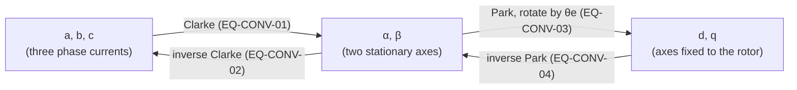

# Conventions

Every model, test and UI value in the simulator uses the conventions on this page. Datasheets don't agree with each other (peak or RMS? phase or line-to-line? poles or pole pairs?), so the [datasheet wizard](#datasheet-variants) converts whatever a seller gives into these canonical quantities.

:::tip In plain words
A three-phase motor has three currents that keep changing. Two simple coordinate changes turn them into two steady numbers: $i_d$ (current that only pushes on the magnet's field) and $i_q$ (current that makes torque). Most of this page defines those changes and the constants (Kv, Kt, Ke) that tie voltage, speed, current and torque together.
:::

## Symbols

| Symbol | Meaning | Unit | Code / signal name |
|---|---|---|---|
| $p$ | pole **pairs** (a "28-pole" motor has $p = 14$) | – | `motor.winding.pole_pairs` |
| $\theta_m$, $\omega_m$ | mechanical rotor angle, speed | rad, rad/s | `motor.theta`, `motor.omega` |
| $\theta_e$, $\omega_e$ | electrical angle, speed | rad, rad/s | `motor.theta_e`, `motor.omega_e` |
| $i_a, i_b, i_c$ | phase currents (star-equivalent) | A | `motor.i_a` … |
| $i_\alpha, i_\beta$ | stationary-frame currents | A | `motor.i_alpha`, `motor.i_beta` |
| $i_d, i_q$ | rotor-frame currents | A | `motor.i_d`, `motor.i_q` |
| $\lambda_m$ | peak phase flux linkage of the magnets | Wb (V·s) | `motor.electrical.lambda_m` |
| $R$, $L_s$ | per-phase resistance, synchronous inductance (star-equivalent) | Ω, H | `motor.electrical.r_phase`, `…l_phase` |
| $K_t$ | torque constant | N·m/A | `motor.electrical.kt` |
| $K_{e}$ | back-EMF constant, line-to-line peak | V·s/rad | `motor.electrical.ke` |
| $K_v$ | velocity constant | rpm/V | `motor.electrical.kv` |

## Reference frames

The three phase axes $a, b, c$ are 120° apart. The **stationary** $\alpha\beta$ frame has $\alpha$ aligned with phase $a$. The **rotor** $dq$ frame rotates with the rotor: $d$ points along the magnet's north pole flux, and $q$ is 90 electrical degrees ahead of it.

### EQ-CONV-01 — Clarke transform (amplitude-invariant) {/* #eq-conv-01 */}

$$
\begin{aligned}
i_\alpha &= \tfrac{2}{3}\left(i_a - \tfrac12 i_b - \tfrac12 i_c\right) \\
i_\beta  &= \tfrac{1}{\sqrt3}\,(i_b - i_c) \\
i_0      &= \tfrac13\,(i_a + i_b + i_c)
\end{aligned}
$$

The factor $\tfrac23$ makes the transform **amplitude-invariant**: a balanced set with peak phase current $\hat I$ maps to a vector of length $\hat I$. With an isolated star neutral, $i_0 = 0$, so $i_\alpha = i_a$ and $i_\beta = (i_a + 2 i_b)/\sqrt3$.

### EQ-CONV-02 — Inverse Clarke {/* #eq-conv-02 */}

$$
i_a = i_\alpha + i_0,\qquad
i_b = -\tfrac12 i_\alpha + \tfrac{\sqrt3}{2} i_\beta + i_0,\qquad
i_c = -\tfrac12 i_\alpha - \tfrac{\sqrt3}{2} i_\beta + i_0
$$

### EQ-CONV-03 — Park transform {/* #eq-conv-03 */}

$$
i_d = i_\alpha\cos\theta_e + i_\beta\sin\theta_e,\qquad
i_q = -i_\alpha\sin\theta_e + i_\beta\cos\theta_e
$$

### EQ-CONV-04 — Inverse Park {/* #eq-conv-04 */}

$$
i_\alpha = i_d\cos\theta_e - i_q\sin\theta_e,\qquad
i_\beta = i_d\sin\theta_e + i_q\cos\theta_e
$$

The same transforms apply to voltages and flux linkages.

**Check.** With $i_x = \hat I\cos(\theta_e + \varphi - k\tfrac{2\pi}{3})$ for $k = 0,1,2$, EQ-CONV-01/03 give $i_d = \hat I\cos\varphi$ and $i_q = \hat I\sin\varphi$. This was verified numerically for $\hat I = 2$, $\theta_e = 0.7$, $\varphi = 0.3$.

## Angles and speeds

### EQ-CONV-05 — Electrical vs mechanical angle {/* #eq-conv-05 */}

$$
\theta_e = p\,\theta_m + \theta_{e,0},\qquad \omega_e = p\,\omega_m
$$

$\theta_{e,0}$ is the offset between the mechanical zero (e.g. the encoder zero) and the $d$ axis. It is 0 in the plant model, and the encoder calibration (P09.T09) has to find it on a real motor.

- **Positive rotation** is counter-clockwise when looking at the output-shaft end.
- The **load arm angle** $\theta_{load} = 0$ points straight down (stable equilibrium) and is positive counter-clockwise.

## Magnet flux, back-EMF, power and torque

### EQ-CONV-06 — Magnet flux linkage and back-EMF (sinusoidal machine) {/* #eq-conv-06 */}

$$
\psi_{a,pm} = \lambda_m\cos\theta_e,\quad
\psi_{b,pm} = \lambda_m\cos(\theta_e - \tfrac{2\pi}{3}),\quad
\psi_{c,pm} = \lambda_m\cos(\theta_e + \tfrac{2\pi}{3})
$$

$$
e_x = \frac{d\psi_{x,pm}}{dt}
\;\Rightarrow\;
e_a = -\omega_e\lambda_m\sin\theta_e,\qquad e_d = 0,\quad e_q = \omega_e\lambda_m
$$

So the peak **phase** back-EMF is $\hat E_{ph} = \lambda_m\,\omega_e$. Non-sinusoidal (trapezoidal) machines generalise this with a shape function (EQ-MOT, `motor.md`).

### EQ-CONV-07 — Power in the dq frame {/* #eq-conv-07 */}

Because the transform is amplitude-invariant (not power-invariant), power has a factor $\tfrac32$:

$$
P = v_a i_a + v_b i_b + v_c i_c = \tfrac32\,(v_d i_d + v_q i_q)\qquad (i_0 = 0)
$$

- **Sign:** $P > 0$ means power flows *into* the motor (motoring); $P < 0$ is generating/braking.
- **DC bus current** is positive when it is drawn *from* the supply.

### EQ-CONV-08 — Electromagnetic torque (dq) {/* #eq-conv-08 */}

$$
T_e = \tfrac32\,p\,\big(\lambda_m i_q + (L_d - L_q)\, i_d\, i_q\big)
$$

For surface-mount motors ($L_d \approx L_q$, typical of gimbal and outrunner motors) this reduces to $T_e = \tfrac32 p \lambda_m i_q$.

## Motor constants

The canonical constant stored by the simulator is $\lambda_m$. Everything else is derived from it, and the UI shows the derived values as locked (P04.T05).

### EQ-CONV-09 — Back-EMF constant $K_e$ (line-to-line peak) {/* #eq-conv-09 */}

The line-to-line back-EMF is $\sqrt3$ times the phase value:

$$
K_e = \frac{\hat E_{LL}}{\omega_m} = \sqrt3\,p\,\lambda_m\qquad[\mathrm{V\,s/rad}]
$$

### EQ-CONV-10 — Velocity constant $K_v$ {/* #eq-conv-10 */}

$K_v$ is the no-load speed in rpm per volt of **line-to-line peak** back-EMF:

$$
K_v = \frac{60}{2\pi\,K_e}\qquad[\mathrm{rpm/V}]
$$

### EQ-CONV-11 — Torque constant $K_t$ {/* #eq-conv-11 */}

Torque per ampere of **peak phase current** (equal to $i_q$ when $i_d = 0$):

$$
K_t = \tfrac32\,p\,\lambda_m\qquad[\mathrm{N\,m/A}]
$$

### EQ-CONV-12 — Relation between $K_t$ and $K_v$ {/* #eq-conv-12 */}

Combining EQ-CONV-09…11:

$$
K_t = \frac{\sqrt3}{2}K_e = \frac{\sqrt3}{2}\cdot\frac{60}{2\pi K_v} = \frac{8.2699}{K_v}
$$

This is the well-known "$K_t \approx 8.27/K_v$" rule `[ODrive]`. It holds only with these definitions (LL-peak $K_v$, peak-phase-current $K_t$).

### Worked example {/* #worked-example */}

A gimbal motor with $K_v = 100$ rpm/V and 28 magnets ($p = 14$):

| Quantity | Calculation | Value |
|---|---|---|
| $K_e$ | $60 / (2\pi \cdot 100)$ | 0.095493 V·s/rad |
| $\lambda_m$ | $K_e / (\sqrt3 \cdot 14)$ | 0.0039381 Wb |
| $K_t$ | $1.5 \cdot 14 \cdot 0.0039381$ | 0.082699 N·m/A |
| check | $8.2699 / 100$ | 0.082699 N·m/A ✓ |

## Datasheet variants {/* #datasheet-variants */}

### EQ-CONV-13 — Converting datasheet constants to $\lambda_m$ {/* #eq-conv-13 */}

| Datasheet gives | Meaning | Convert to $\lambda_m$ |
|---|---|---|
| $K_v$ [rpm/V], LL **peak** (this page) | no-load rpm per volt of LL peak EMF | $\lambda_m = \dfrac{60}{2\pi\sqrt3\,p\,K_v}$ |
| $K_v$ [rpm/V], LL **RMS** | rpm per volt RMS LL | $\lambda_m = \dfrac{60\sqrt2}{2\pi\sqrt3\,p\,K_v}$ |
| "rpm per DC volt" (hobby, measured at no load) | ideal drive: LL peak EMF ≈ $V_{dc}$ at no load | ≈ LL-peak $K_v$ (**approximation**: losses and timing advance make real values deviate by ~5–15 %) |
| $K_e$ [V/krpm], LL **RMS** (industrial servo) | volts RMS per 1000 rpm | $\lambda_m = \dfrac{\sqrt2\,K_e\,/\,(1000 \cdot 2\pi/60)}{\sqrt3\,p}$ |
| $K_t$ [N·m/A], per **peak** phase A | this page | $\lambda_m = K_t / (1.5\,p)$ |
| $K_t$ [N·m/A], per **RMS** phase A | torque per A RMS | $\lambda_m = K_t / (1.5\sqrt2\,p)$ |
| $K_t$ per **DC bus** A, six-step on an ideal trapezoidal motor | two phases conduct the bus current | $K_{t,dc} = K_e$ (flat-top LL); see EQ-MOT for the shape-dependent conversion |

When the convention is unclear, the [datasheet wizard](#datasheet-variants) **asks** instead of guessing (P04.T12).

## Windings: star, delta and line-to-line measurements

### EQ-CONV-14 — Star-equivalent of a delta winding {/* #eq-conv-14 */}

All per-phase quantities are stored as **star (Y) equivalents**. A delta winding with phase values $R_\Delta$, $L_\Delta$ and phase flux linkage $\lambda_\Delta$ is equivalent at the terminals to a star winding with

$$
R_Y = \frac{R_\Delta}{3},\qquad L_Y = \frac{L_\Delta}{3},\qquad \lambda_Y = \frac{\lambda_\Delta}{\sqrt3}
$$

The equivalent star EMF is also shifted by 30°. That only moves the encoder offset $\theta_{e,0}$, so it is absorbed into the calibration.

### EQ-CONV-15 — Line-to-line measurements {/* #eq-conv-15 */}

A multimeter or LCR meter between two terminals (third terminal open) measures:

$$
R_{LL} = 2R_Y,\qquad L_{LL} = 2L_s = 2(L - M)
$$

Both relations hold for **both** star and delta windings. For a delta winding, $R_{LL} = R_\Delta \parallel 2R_\Delta = \tfrac23 R_\Delta = 2R_Y$. So the star-equivalent phase values are always half the line-to-line readings.

## Temperatures and units

- All internal values are SI. Temperatures are stored in **kelvin** and shown in °C by default.
- The UI can display other units (rpm, kgf·cm, mH …). The conversion happens only at the edges (CONVENTIONS §4).

## References

- `[Krishnan2010]` ch. 3–4: dq models, transformations, torque.
- `[Mohan2014]` ch. 3: space vectors and the $\tfrac23$ scaling.
- `[TI-BPRA073]`: Clarke/Park definitions used by most MCU FOC code.
- `[ODrive]`: the $K_t = 8.27/K_v$ relation for hobby motors.

See [References](./references.md) for full citations.
